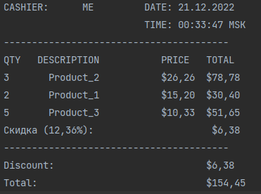

# Clevertec task

To start working with program you should open main project folder (`task_clevertec`) and run 
the following command:

    gradlew run --args="fileWithDiscountCard=discountCard.txt 2-3 1-2 3-5 card-1234"

First arg is the name of file, next up following order pairs in format `productId-quantity` and ends
with discount card information (optional).
File with discount cards data allocated in `resources` folder.For generating product and discount data I've used generators.  
Receipts generated in `receipts` with file naming format `receipt_dd-MM-yyyy-hh-mm` containing body:

